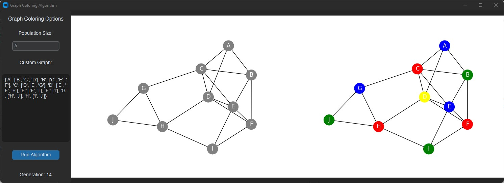
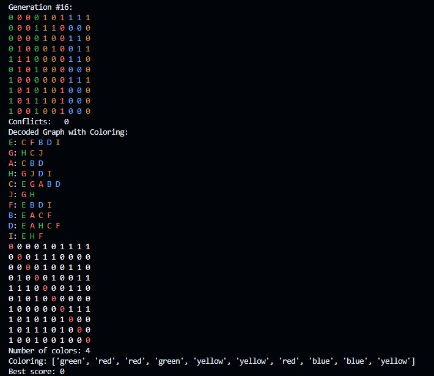

# Graph-Coloring

Graph Coloring Problem (GCP) using Genetic Algorithm



## Installation

To run this code, you need Python installed on your system along with the `termcolor` module. You can install the necessary dependencies using the following commands:

```bash
# Clone the repository
git clone https://github.com/NoureldinAyman/Graph-Coloring.git

# Navigate into the project directory
cd Graph-Coloring

# Install dependencies
pip install termcolor
pip install customtkinter
```

GraphColoringTerminal

## Overview

The `GraphColoringTerminal.py` code implements a genetic algorithm to solve the graph coloring problem. The goal is to color the nodes of a graph such that no two adjacent nodes share the same color. The code uses a genetic algorithm to evolve a population of solutions towards an optimal or near-optimal coloring.

## Usage

You can run the code directly from the command line:

```bash
python GraphColoringTerminal.py
```



## Main Components

### Constants

- `target`: The target number of conflicts (default is 0).
- `COLORS`: A list of colors used for graph coloring (`['blue', 'red', 'green', 'yellow']`).

### Methods

#### `encode_adjacency_matrix(edges, num_nodes)`

Encodes the graph as an adjacency matrix.

- **Parameters**:
  - `edges`: List of tuples representing the edges of the graph.
  - `num_nodes`: Number of nodes in the graph.
- **Returns**: A 2D list representing the adjacency matrix.

#### `validate_adjacency_matrix(matrix)`

Validates if the adjacency matrix is square and symmetric.

- **Parameters**:
  - `matrix`: The adjacency matrix to validate.
- **Returns**: `True` if the matrix is valid, `False` otherwise.

#### `encode(graph)`

Encodes a graph into an adjacency matrix and node index.

- **Parameters**:
  - `graph`: A dictionary representing the graph.
- **Returns**: A tuple containing the adjacency matrix and node index.

#### `decode(adj_matrix, node_index)`

Decodes an adjacency matrix and node index back into a graph.

- **Parameters**:
  - `adj_matrix`: The adjacency matrix.
  - `node_index`: The node index mapping.
- **Returns**: A dictionary representing the graph.

### Classes

#### `GraphColoring`

Represents a solution to the graph coloring problem.

- **Methods**:
  - `__init__(self, adjacency_matrix, node_index)`: Initializes the graph coloring object.
  - `print_decoded_graph(self)`: Prints the decoded graph with colors.
  - `get_fitness(self)`: Calculates the fitness (number of conflicts) of the coloring.
  - `crossover(self, parentA, parentB)`: Performs crossover between two parent solutions using tournament selection.
  - `mutate(self)`: Mutates the coloring of the graph.

### Helper Functions

#### `colorize(graph)`

Visualizes the adjacency matrix with colors.

- **Parameters**:
  - `graph`: The graph coloring object.

#### `summarize(generation, graph, fitness)`

Prints a summary of the current generation, including the colored graph and fitness.

- **Parameters**:
  - `generation`: The current generation number.
  - `graph`: The graph coloring object.
  - `fitness`: The fitness score of the graph.

#### `colorize_conflicts(graph)`

Highlights conflicts in the graph coloring.

- **Parameters**:
  - `graph`: The graph coloring object.

## Main Algorithm Flow

1. **Graph Definition**: The code defines a sample graph using a dictionary.
2. **Graph Encoding**: The graph is encoded into an adjacency matrix and node index.
3. **Initial Population**: A population of graph colorings is generated.
4. **Genetic Algorithm Loop**:
   - Fitness of each individual in the population is assessed.
   - The best individual is summarized.
   - A mating pool is created using tournament selection.
   - New offspring are generated through crossover and mutation.
   - The process repeats until the best score meets the target.

## Example Graph

The example graph used in the source code:

```python
graph = {
    'A': ['B', 'C', 'D'],
    'B': ['C', 'E', 'F'],
    'C': ['D', 'E', 'G'],
    'D': ['E', 'F', 'H'],
    'E': ['F', 'I'],
    'F': ['I'],
    'G': ['H', 'J'],
    'H': ['I', 'J']
}
```

## GraphColoringGUI


The same exact code as the GraphColoringTerminal but featuring a simple GUI made using CustomTkinter to visualize the coloring side by side and to easily enter a custom graph.


## Conclusion

This code provides a practical implementation of a genetic algorithm to solve the graph coloring problem. By adjusting parameters and modifying the graph, you can experiment with different configurations and observe how the genetic algorithm evolves solutions over generations.
